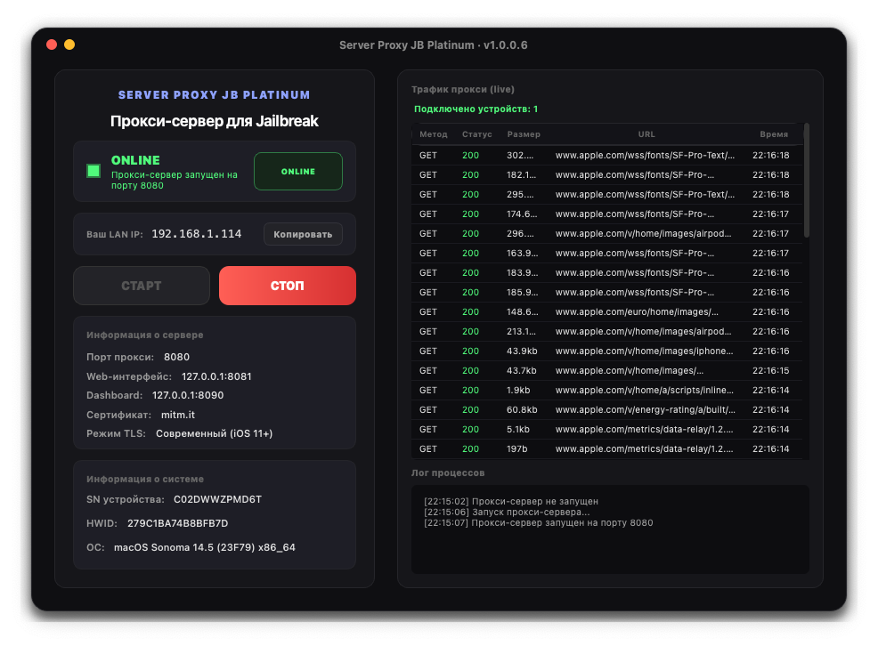

# Server Proxy JB Platinum

[](https://github.com/SmartMaster35Rus/Server-Proxy-JB-Platinum-Public/releases)
[](https://github.com/SmartMaster35Rus/server-proxy-jb-platinum)
[](https://github.com/SmartMaster35Rus/server-proxy-jb-platinum)

**Локальный MITM-прокси сервер с GUI в один клик для Jailbreak и диагностики iOS-устройств.**

Запустил — подключил телефон — видишь весь трафик. Никаких терминалов, конфигов и веб-интерфейсов.

<p align="center">
  
</p>

---

## Что умеет

- **Однокнопочный СТАРТ/СТОП** — без консоли и командной строки
- **Live-таблица трафика** — метод, статус, URL, размер, время запроса
- **Полный MITM-перехват** — HTTP + HTTPS через mitmproxy
- **Portable** — один EXE, работает без установки с флешки
- **Встроенный Python + mitmproxy** — не требует ничего доустанавливать
- **Автоопределение LAN IP** — для быстрой настройки прокси на телефоне
- **Автоочистка логов** — при выходе сервер останавливается, кэш чистится
- **RU / EN / ES** — три языка интерфейса

## Требования

| Что | Детали |
|-----|--------|
| ОС | Windows 10/11 (64-bit) |
| VPN | Обязательно включить любой рабочий VPN на ПК |
| Права | Запуск от администратора |

## Скачать

👉 **[Скачать последнюю версию](https://github.com/SmartMaster35Rus/Server-Proxy-JB-Platinum-Public/releases/latest)**

| Файл | Назначение |
|------|-----------|
| `server_proxy_jb_platinum.exe` | Портативный — просто запусти |
| `server_proxy_jb_platinum_setup.exe` | Установщик с ярлыком на рабочем столе |

## Как пользоваться

### 1. Запуск

1. Запусти EXE от администратора
2. Включи **VPN** на ПК
3. Нажми **СТАРТ** → подтверди что VPN включен
4. Сервер поднимется за 2-5 секунд

### 2. Настройка телефона

Открой на iPhone/iPad:

```
Настройки → Wi‑Fi → ⓘ у сети → HTTP Proxy → Вручную
```

| Поле | Значение |
|------|----------|
| Сервер | `<LAN IP>` (показан в приложении) |
| Порт | `8080` |

### 3. Установка сертификатов

Открой Safari и перейди по порядку:

1. `http://mitm.it` → iOS → установить сертификат
2. `http://tlsroot.litten.ca` → установить **ISRG Root X1**
3. `http://tlsroot.litten.ca` → установить **ISRG Root X2**

Затем: **Настройки → Основные → Об устройстве → Доверие сертификатов** → включить `mitmproxy`

### 4. Работа

Трафик с устройства появится в таблице справа в реальном времени.

> После завершения отключи HTTP-прокси в настройках Wi‑Fi телефона.

## Скриншоты

| Окно | Описание |
|------|----------|
|  | Главное окно с трафиком |

*(добавь больше скриншотов при необходимости)*

## Продвинутое

### Встроенный веб-интерфейс mitmweb

Если нужен полный веб-интерфейс mitmweb — открой в браузере:

```
http://127.0.0.1:8081
```

### Очистка портов

Если порты 8080/8081 заняты:

```powershell
netstat -ano | findstr ":8080"   # найти процесс
taskkill /F /PID <номер>         # завершить
```

## FAQ

| Вопрос | Ответ |
|--------|-------|
| Сервер не стартует | Проверь что порты 8080/8081 свободны |
| Нет трафика | Проверь IP и порт в настройках прокси телефона |
| Ошибка сертификата | Удали старый профиль mitmproxy в настройках телефона |
| Не видно HTTPS | Проверь что сертификат mitmproxy установлен и ему доверяют |

## Лицензия

Proprietary. All rights reserved. © SmartMaster35Rus, 2026.

---

[Сообщить об ошибке](https://github.com/SmartMaster35Rus/Server-Proxy-JB-Platinum-Public/issues) · [Все релизы](https://github.com/SmartMaster35Rus/Server-Proxy-JB-Platinum-Public/releases)
